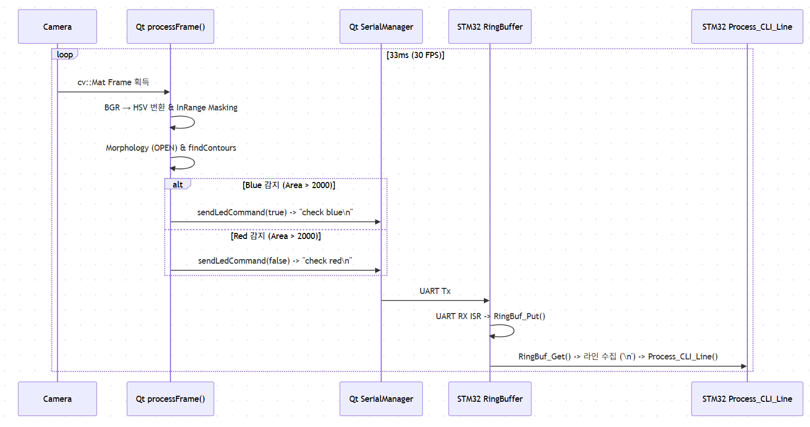
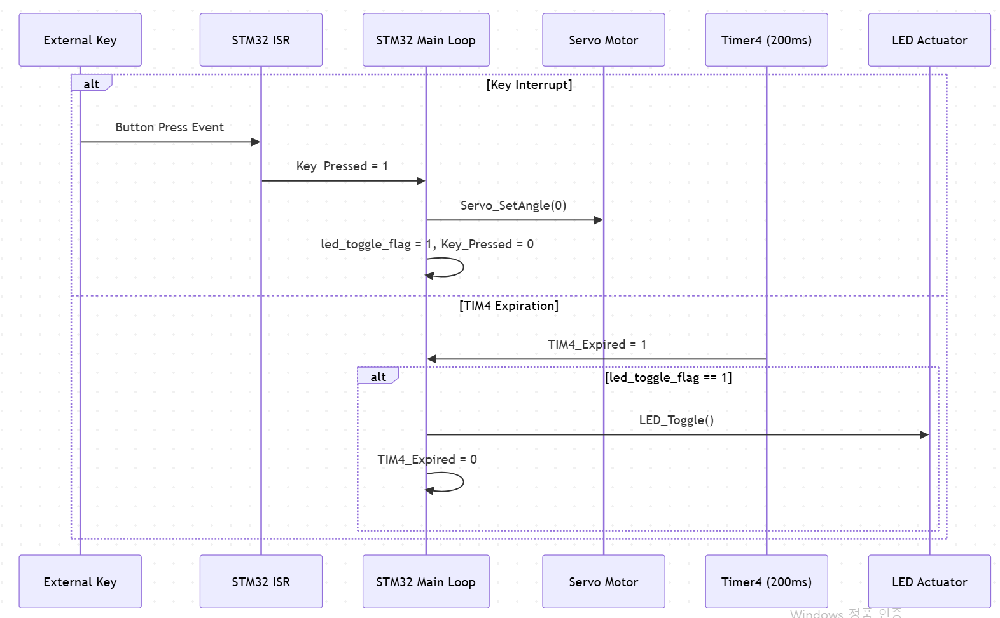

# 비전 기반 스마트 LED & 서보 제어 시스템 상위 설계서 v1.0

> Smart Vision & Motion Control System — High-Level Design Document

---

## 1. 주제 및 목표

### 1-1 주제

제시된 소스코드는 **OpenCV 기반 비전 인식 Qt 데스크톱 제어기**와 **링버퍼 CLI 기반 STM32 펌웨어** 간의 2계층 구조로 이루어진 **스마트 LED 및 서보모터 관제 시스템**이다. 데스크톱 앱에서 실시간 영상 내 색상(Blue/Red)을 추적하거나 UI 버튼을 통해 제어 패킷을 송신하면, STM32가 링버퍼 구조의 비동기 CLI로 이를 수신·해석하여 LED 및 서보모터를 제어한다.

### 1-2 목표

* **비전 기반 자동 제어**: OpenCV HSV 색상 임계값 필터링 및 윤곽선(Contour) 추적을 통한 객체 위치 및 면적 기반 자동 제어 명령 생성
* **안정적인 비동기 UART 통신**: Qt 이벤트 필터 기반 시리얼 포트 동적 스캔 및 STM32 링버퍼(Ring Buffer) 기반 수신 데이터 유실 방지
* **CLI 패킷 처리 및 반응성 확보**: 개행 문자(`\r`, `\n`) 단위 프레임 바운더리 복원, Echo-back 지원 명령어 처리기 구현
* **하드웨어 인터럽트 연동**: EXTI 키 인터럽트 및 TIM4 반복 타이머 인터럽트를 활용한 멀티태스킹 동작 구현

### 1-3 시스템 개요

```
[ 웹캠 (Camera) ] ──(Video Frame)──> [ Qt 데스크톱 제어기 (OpenCV/UI) ]
                                                │
                                        (UART Serial 115200)
                                                ▼
                                    [ STM32 펌웨어 (Main/CLI) ]
                                                │
                          ┌─────────────────────┴─────────────────────┐
                          ▼                                           ▼
                 [ LED / TIM4 Timer ]                        [ Servo Motor / Key ]

```

---

## 2. 개발 목표 및 개발 결과

### 2-1 개발 목표 및 결과 비교

| 기능 | 담당 모듈 | 구현 상태 | 비고 |
| --- | --- | --- | --- |
| **카메라 프레임 획득** | Qt (`cv::VideoCapture`) | ✅ | 약 30 FPS (`QTimer` 33ms) 렌더링 |
| **HSV 색상 검출 및 추적** | Qt (`processFrame`) | ✅ | Blue / Red 영역 필터링 및 모폴로지 연산 |
| **시리얼 포트 동적 갱신** | Qt (`eventFilter`, `updateSerialPorts`) | ✅ | 콤보박스 클릭 시 미연결 상태일 때 포트 리스트 자동 스캔 |
| **비전 자동 제어** | Qt (`sendLedCommand`) | ✅ | 면적 2000.0 이상 감지 시 상태 중복 전송 방지 Latch 구현 |
| **매뉴얼 명령 전송** | Qt (`on_btn..._clicked`) | ✅ | LED/Servo 제어 문자열 송신 (`led on`, `servo on` 등) |
| **UART 링버퍼 수신** | STM32 (`RingBuf_Put`, `RingBuf_Get`) | ✅ | Interrupt → Ring Buffer 구조로 오버플로우 방지 |
| **CLI 명령 파싱** | STM32 (`Process_CLI_Line`) | ✅ | 개행문자 수신 시 라인 버퍼 수집 후 처리 |
| **키 인터럽트 처리** | STM32 (`Key_Pressed`) | ✅ | 스위치 눌림 감지 시 서보모터 0도 설정 및 토글 플래그 세팅 |
| **타이머 반복 동작** | STM32 (`TIM4_Expired`) | ✅ | 200ms 주기로 LED 토글 수행 |

### 2-2 계층별 책임

| 계층 | 주 책임 | 하지 않는 것 |
| --- | --- | --- |
| **Qt 데스크톱 서버** | - 영상 프레임 분석 및 색상 좌표/면적 계산<br>

<br>- 사용자 GUI 제어 패킷 생성 및 시리얼 전송<br>

<br>- 포트 연결 관리 및 렌더링 | - 물리 액추에이터 direct 제어<br>

<br>- 하드웨어 타이머 관리 |
| **STM32 펌웨어** | - UART 수신 데이터 링버퍼 적재 및 CLI 파싱<br>

<br>- 키 인터럽트 및 TIM4 타이머 기반 LED/서보 구동<br>

<br>- 터미널 Echo-back 출력 | - 비전 알고리즘 연산<br>

<br>- 프레임 버퍼 저장 |

---

## 3. 데이터 흐름

### 3.1 흐름 A — 비전 기반 자동 제어



### 3.2 흐름 B — 하드웨어 인터럽트 및 타이머 제어



---

## 4. 인터페이스 및 프로토콜 정의

### 4.1 UART 시리얼 설정

| 항목 | 설정값 |
| --- | --- |
| **물리 계층** | USB Virtual COM Port / UART |
| **Baud Rate** | 115200 bps |
| **Data / Parity / Stop** | 8 Bits / No Parity / 1 Stop Bit |
| **Flow Control** | None |

### 4.2 제어 명령 집합 (Qt → STM32)

| 전송 패킷 (ASCII) | 기능 정의 | STM32 처리 동작 |
| --- | --- | --- |
| `led on\n` | LED 켜기 | LED GPIO High |
| `led off\n` | LED 끄기 | LED GPIO Low |
| `led toggle\n` | LED 토글 모드 | `led_toggle_flag` 토글 전환 |
| `servo on\n` | 서보모터 동작 | 서보모터 지정 각도 이동 |
| `servo off\n` | 서보모터 정지 | 서보모터 원점 이동 |
| `check blue\n` | 비전 파란색 감지 알림 | `LED_ON_STATE` 전환 및 LED 제어 |
| `check red\n` | 비전 빨간색 감지 알림 | `LED_OFF_STATE` 전환 및 LED 제어 |

---

## 5. 계층별 상세 설계

### 5.1 Qt 데스크톱 애플리케이션 계층

#### [1] UI 동적 이벤트 필터링 (`eventFilter`)

시리얼 포트 콤보박스(`cbxSelectSerialCh`) 클릭 이벤트(`QEvent::MouseButtonPress`)를 낚아채서, 통신이 열려있지 않은 경우(`!serial->isOpen()`) 포트 목록을 동적으로 스캔하여 UI 편의성을 제공한다.

#### [2] OpenCV HSV 파이프라인 (`processFrame`)

1. **색상 공간 변환**: `BGR` → `HSV`
2. **이중 임계값 마스킹**:
* Blue Mask: $H \in [100, 140], S \in [120, 255], V \in [70, 255]$
* Red Mask: $H \in [0, 10] \cup [170, 180], S \in [120, 255], V \in [70, 255]$ (이중 마스크 OR 연산)


3. **노이즈 제거**: `cv::MORPH_OPEN` 커널($5 \times 5$ Rect)을 적용하여 자잘한 노이즈 바이트 제거
4. **최대 면적 윤곽선 추출**: 면적이 $2000.0$ 초과인 객체 중 최대 면적 객체를 선별하여 Bounding Box 표시 및 명령 생성
5. **상태 래치 제어 (`sendLedCommand`)**: 이전 전송 상태(`currentLedState`)와 비교하여 동일한 명령의 무한 반복 전송을 방지

#### [3] 이미지 포맷 변환 (`matToQImage`)

`CV_8UC3` (BGR) 데이터를 `QImage::Format_RGB888`로 변환할 때 `cv::cvtColor`를 적용해 색상 뒤틀림을 방지하며, 메모리 복사(`.copy()`)를 통해 안전한 Qt UI 스레드 렌더링을 보장한다.

---

### 5.2 STM32 펌웨어 계층

#### [1] 시스템 초기화 (`Sys_Init`)

* **FPU 활성화**: `SCB->CPACR |= (0x3 << 10*2)|(0x3 << 11*2);` 하드웨어 부동소수점 코프로세서 전원 공급
* **버퍼링 해제**: `setvbuf(stdout, NULL, _IONBF, 0);` 전송 지연 없는 즉각적인 `printf` 터미널 출력 환경 조성
* **드라이버 모듈 초기화**: Clock, UART2(115200), LED, Servo, Ring Buffer 순차 초기화

#### [2] 비동기 CLI 데이터 처리 루프 (`Main`)

1. **ISR ↔ RingBuffer 연결**: UART RX 인터럽트로 수신된 `Uart_Data`를 `RingBuf_Put`을 통해 원형 큐에 비동기 입력
2. **문자열 조립 및 Echo-back**:
* `RingBuf_Get`으로 1바이트씩 추출 후 터미널에 Echo 출력(`printf("%c", ch)`)
* 백스페이스(`\b`, `0x7F`) 수신 시 라인 버퍼 인덱스 감소 및 화면 문자 삭제(` \b`)
* 개행 문자를 만나면 문자열 종단(`\0`) 후 `Process_CLI_Line()`에 전달하여 명령 수행


#### [3] 인터럽트 비동기 이벤터 (`Key_ISR` & `TIM4`)

* **Key Event**: 키 입력 시 화면에 `[INT] KEY Pressed!!!`를 출력하고 서보모터를 즉시 0도로 회전시키며, `led_toggle_flag`를 활성화
* **TIM4 Event**: 200ms 단위 타이머 만료 시 `led_toggle_flag`가 세팅된 상태라면 LED를 반전시키는 주기적 백그라운드 작업 수행

---

## 6. 대표 운용 시나리오

### 6.1 비전 파란색/빨간색 물체 자동 제어

1. 사용자가 시리얼 포트를 선택하고 **[connect]** 버튼을 눌러 UART를 연결한다.
2. 카메라 영상에 **파란색 물체**가 등장하고 면적이 Threshold($2000.0$)를 넘어서면:
* Qt는 화면에 `BLUE (LED ON)` 텍스트와 파란색 박스를 그린다.
* `check blue\n` 패킷이 STM32로 전송된다.


3. STM32는 링버퍼로 이를 파싱하여 CLI 명령을 실행하고, LED를 켠다.
4. 카메라 영상에 **빨간색 물체**가 등장하면:
* Qt는 `RED (LED OFF)` 박스를 표시하고 `check red\n` 패킷을 송신한다.
* STM32는 수신 후 LED를 끈다.


### 6.2 터미널/매뉴얼 버튼 제어

1. 사용자 UI의 `btnLedToggle` 클릭 시 Qt는 `"led toggle\n"`을 전송한다.
2. STM32 CLI 파서가 라인 조립 완료 후 해당 명령을 식별하여 `led_toggle_flag` 상태를 반전시킨다.
3. `TIM4` 200ms 타이머 스케줄러에 의해 LED가 블링크 동작을 시작한다.

---

## 7. 기술 스택 요약

| 계층 | 사용 기술 / 라이브러리 | 주요 역할 |
| --- | --- | --- |
| **Qt App (C++)** | Qt Widgets, QSerialPort, OpenCV 4.x | GUI, 영상 처리, HSV 필터링, 시리얼 통신 |
| **STM32 (C)** | Bare-metal C, CMSIS, Ring Buffer | USART RX Interrupt, Timer Interrupt, CLI, Motor/LED |
| **통신 프로토콜** | ASCII 기반 Custom CLI Protocol | 115200 8N1, 개행 구분자 (`\n`, `\r`) |

---

## 8. 설계 특성 및 확장 지점

* **안정적인 데이터 분리**: 수신 인터럽트 핸들러 내에서 복잡한 로직을 수행하지 않고 링버퍼에 데이터만 밀어 넣음으로써 **인터럽트 지연 시간(Latency)을 극대화하여 줄임**.
* **상태 중복 전송 방지**: Qt 영역에서 `currentLedState` 래치를 통해 비전 연산이 매 프레임(33ms) 실행되더라도 명령 전송은 **상태 변화가 일어나는 시점에만 단 1회 전송**되도록 최적화됨.
* **확장 지점**:
1. **Haar Cascade / Deep Learning 연동**: 단순 HSV 색상 인식 외에 얼굴/눈 인식 모델을 추가 적용하여 스마트 헬스케어 및 위험 감지 시스템으로 확장 가능.
2. **Ack 메시지 구조화**: STM32의 `Process_CLI_Line` 실행 후 처리 결과(OK/FAIL) 패킷을 Qt에 피드백하는 양방향 핸드셰이킹 구조 보완 가능.